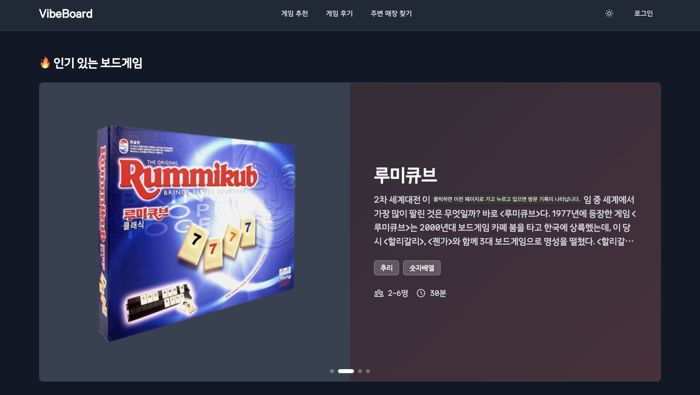
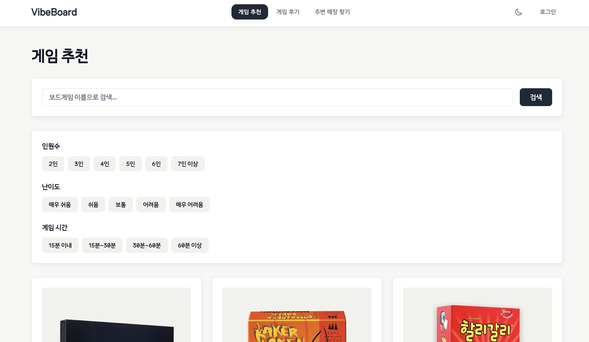
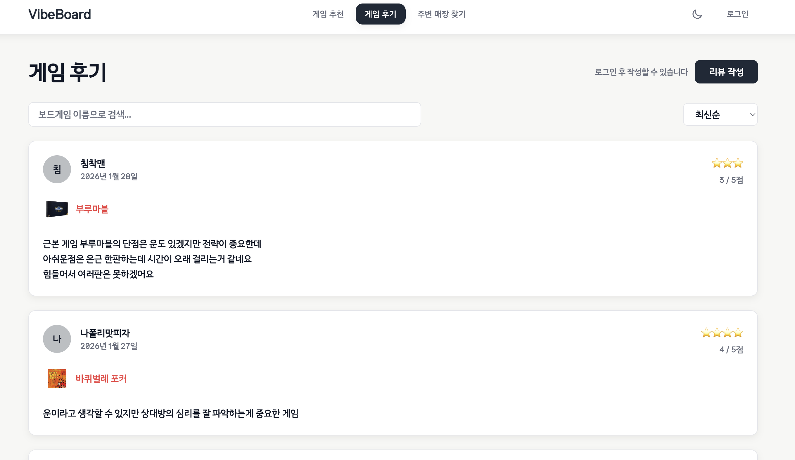
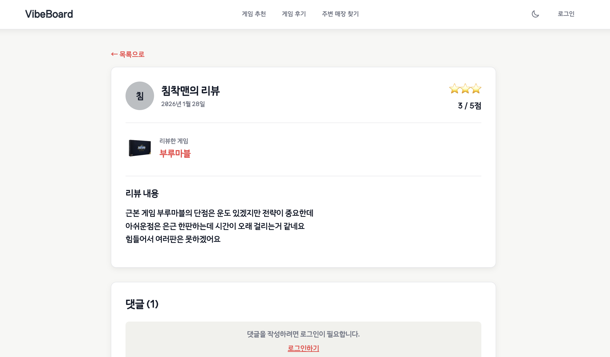
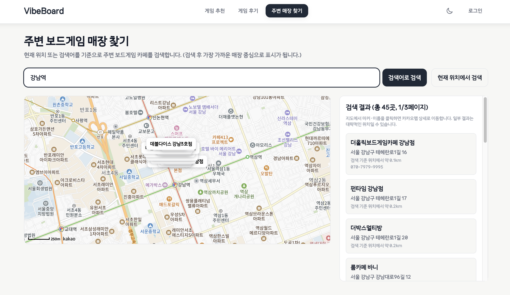

# VibeBoard

> **보드게임 추천 · 후기 · 주변 카페 검색**을 한 곳에서 제공하는 위치 기반 웹 서비스.
> Supabase 인증·권한 제어와 카카오 로컬 API·카카오맵 SDK를 활용했고, **Lighthouse 측정을 기반으로 한 성능 개선**을 직접 진행한 프로젝트입니다.


[](https://react.dev/)
[](https://www.typescriptlang.org/)
[](https://vitejs.dev/)
[](https://tailwindcss.com/)
[](https://tanstack.com/query)
[](https://zustand-demo.pmnd.rs/)
[](https://supabase.com/)
[](https://apis.map.kakao.com/)

**Live**: [vibeboard-nine.vercel.app](https://vibeboard-nine.vercel.app)
**Repo**: [github.com/guiyoung2/VibeBoard](https://github.com/guiyoung2/VibeBoard)



---

## 1. 현재 품질 지표 (스냅샷)

> 측정일: 2026-05-18 · Chrome 시크릿 모드 · Mode: Navigation · Device: Mobile · 각 페이지 3회 중앙값

### 1-1. Lighthouse

| 페이지 | Performance | LCP | CLS | FCP | Best Practices |
| ------ | ----------- | --- | --- | --- | -------------- |
| `/` (메인) | **77** | 6.2s | 0.002 | 1.5s | 100 |
| `/games` (게임 목록) | **95** | 2.3s | 0.107 | 1.6s | 100 |
| `/games/:id` (게임 상세) | **72** | 6.6s | 0.123 | 1.5s | 100 |
| `/reviews` (후기 목록) | **75** | 6.0s | 0.107 | 1.6s | 100 |
| `/cafes` (주변 매장) | **75** | 5.9s | 0.105 | 1.5s | 100 |

**참고**: Best Practices 전 페이지 100점, INP 전 페이지 0ms.
`/games` 가 LCP 2.3s로 가장 빠름(정적 JSON 데이터). 나머지 페이지는 Supabase cold start 포함 fetch 완료 후 렌더.
`/games/:id` CLS 0.123은 0.1(Good 기준) 초과 잔존 — 이미지 외 동적 콘텐츠(조건부 렌더, 텍스트 비동기 로드)가 원인으로 추정.

### 1-2. 번들 크기 (빌드 산출물)

> `npm run build` 기준 · gzip 크기

| 청크 | raw | gzip |
| ---- | --- | ---- |
| 앱 메인 (`index-*.js`) | 206 kB | 65 kB |
| vendor-supabase | 169 kB | 44 kB |
| vendor-query | 35 kB | 11 kB |
| vendor-router | 35 kB | 13 kB |
| vendor-react | 11 kB | 4 kB |
| 라우트 lazy 청크 합계 | ~62 kB | ~28 kB |
| **dist 총합** | **~560 kB** | **~170 kB** |

카카오맵 SDK는 번들에 포함되지 않음 — `/cafes` 진입 시점에 동적 `<script>` 삽입.

### 1-3. 테스트 커버리지

| 지표 | 수치 |
| ---- | ---- |
| Statements | 10.93% (131/1198) |
| Branches | 8.80% (83/943) |
| Functions | 14.81% (44/297) |
| Lines | 11.13% (120/1078) |

테스트 수: 24개 (4파일). 핵심 레이어(`api/reviews.ts`, `stores/`, `pages/Reviews.tsx`, `components/Button.tsx`) 집중 커버.
카카오 SDK·Supabase 의존성이 강한 대형 페이지 컴포넌트는 단위 테스트 범위 밖.

---

## 2. 기술 스택과 선택 이유

| 구분 | 기술 | 선택 이유 | 판정 |
| ---- | ---- | --------- | ---- |
| **빌드** | Vite 7 | HMR 빠름, ESM 기반, `VITE_` 환경변수로 클라이언트 설정 분리. `manualChunks`·플러그인 실제 활용 | ✅ |
| **언어** | TypeScript 5 strict | Supabase·카카오 응답을 도메인 타입으로 명시적 캐스팅. 외부 API 응답 형이 깨지면 위험한 부분 보호 | ✅ |
| **UI** | React 19 | 자동 batching 실제 렌더 사이클에서 활용 | ✅ |
| **스타일** | Tailwind CSS 4 | 다크 모드·반응형 일관 적용, `@theme`로 디자인 토큰 정의 | ✅ |
| **라우팅** | React Router 7 | SPA 라우트 선언 + `lazy()` + `<Suspense>`. `loader`/`action` 데이터 라우팅 기능은 미사용 — v6 대비 실제 차이 없음 | ⚠️ |
| **서버 상태** | TanStack Query 5 | `staleTime: 5min`, `retry: 2` 지수 백오프, `invalidateQueries` 후 목록 동기화 실제 사용. 단, `Reviews.tsx`는 3개 쿼리 수동 조인 구조로 라이브러리 이점 부분 미활용 | ⚠️ |
| **클라이언트 상태** | Zustand 5 | `authStore`(user·session·nickname)와 `themeStore`(다크모드 영속) — 진짜 크로스-컴포넌트 전역 상태에 적합. 보일러플레이트 최소 | ✅ |
| **BaaS** | Supabase | anon key + sessionStorage로 RLS에 권한 위임. 별도 백엔드 없이 Auth + Postgres + CRUD 처리 | ✅ |
| **지도·장소** | 카카오 Local API + Map JS SDK | 한국 지역 검색 정확도, 동적 스크립트 로드·커스텀 오버레이 핵심 기능 활용 | ✅ |
| **배포** | Vercel | Vite SPA 배포 즉시 가능 | ✅ |

**약점 정리**:
- React Router 7은 "데이터 라우팅 지원"이 선택 이유였으나 실제로는 `<Route>` 선언·`lazy()` 수준만 사용. v6와 차이 없음.
- TanStack Query는 `useQuery`·`staleTime`·`invalidateQueries`는 실사용했으나 `Reviews.tsx`의 다중 쿼리 수동 조인은 단순 fetch 래퍼와 다르지 않음.

---

## 3. 주요 기능

### 게임 추천 (`/games`)



- Supabase 보드게임 목록 카드 렌더 (게임명·이미지·카테고리·인원·플레이 시간)
- **상세 페이지** (`/games/:id`): 상세 정보 + 관련 리뷰 목록


### 게임 후기 (`/reviews`)



- 보드게임별·평점별 필터·정렬
- **리뷰 상세** (`/reviews/:id`): 작성자·평점·내용, 본인 글만 수정/삭제



- **리뷰 작성** (`/reviews/create`): 로그인 후 보드게임 선택·평점·내용 입력
  - 배포 환경에선 `VITE_ALLOW_REVIEW_CREATE` 플래그로 등록 비활성화 가능 (실제 DB 쓰기 차단)

### 주변 카페 (`/cafes`)



- **현재 위치 기반**: `navigator.geolocation` → 좌표로 카카오 Local API 키워드 검색 (반경 5km)
- **검색어 기반**: 역·동 등 키워드로 좌표 1건 조회 후, 그 좌표 기준 동일 키워드 검색
- **페이지네이션**: 1·2·3페이지(최대 45건), 선택 페이지만 지도·목록에 표시
- 카카오 Map SDK + 커스텀 오버레이로 마커 라벨 표시

### 인증·프로필

- **Supabase Auth**: 이메일·비밀번호 + Google · GitHub OAuth
- 최초 로그인 시 닉네임 설정 강제
- 프로필 페이지에서 닉네임 수정 + 내가 작성한 리뷰 목록
- 세션은 **sessionStorage** (탭 닫으면 로그아웃)

### 공통 UX

- 다크 모드 (localStorage 영속)
- 모바일 햄버거 / 데스크톱 네비게이션
- 전역 ErrorBoundary, 스켈레톤 UI, 네트워크 끊김 배너, 쿼리 실패 시 재시도 버튼

---

## 4. 트러블슈팅 / 의사결정

### 4-1. 성능 개선 (LCP 44.3s → 현재 5.9~6.6s)

**초기 문제**
초기 배포 후 Mobile 환경 Lighthouse를 돌렸을 때 Performance 점수가 한 자릿수, LCP 44.3초, CLS 0.362, JS Payload 8.4MB가 전송되는 결과가 나왔습니다. 사용자가 실제로는 페이지를 거의 사용할 수 없는 수준이었습니다.

**원인 분석**

| 도구 | 발견 사항 |
| ---- | --------- |
| Lighthouse Treemap | 카카오맵 SDK 등 외부 라이브러리가 초기 번들에 모두 포함됨 |
| Network 패널 | 보드게임 이미지·히어로 슬라이더가 원본 사이즈로 로드 (개당 1~2MB) |
| Performance 패널 (Long Task) | 메인 스레드 블로킹이 길게 이어지며 인터랙션 응답 지연 |
| Layout Shift 디버깅 | 이미지·폰트가 사이즈 미지정 상태로 들어오며 CLS 누적 |

**개선 작업**

1. **번들 사이즈 축소 (8.4MB → 현재 ~560KB raw)**
   - 카카오맵 SDK는 `/cafes` 진입 시점에만 `<script>` 동적 삽입
   - 사용하지 않는 의존성 정리, 큰 라이브러리는 named import로 tree-shaking 유도
   - Vite의 manualChunks로 vendor 청크 4개 분리 (react·router·query·supabase)

2. **이미지 최적화 (LCP 단축)**
   - 카드용 썸네일은 Supabase Storage 변환 파라미터로 리사이즈된 URL 사용
   - 히어로 슬라이더 첫 이미지에 `fetchpriority="high"` + preload
   - 카드 이미지는 `loading="lazy"` + `decoding="async"`

3. **CLS 방어**
   - 모든 ``에 `width`·`height` 명시 (`GameCard.tsx`·`HeroSlider.tsx`·`Reviews.tsx`)
   - 폰트는 `font-display: swap` + size-adjust로 fallback과 동일 크기 보정
   - 스켈레톤 UI를 실제 콘텐츠와 같은 높이로 맞춰 점프 방지

4. **렌더 차단 자원 제거**
   - 카카오맵 SDK 등 즉시 필요 없는 스크립트는 `defer` / 동적 로드

**현재 잔여 한계**

| 항목 | 현황 | 미해결 이유 |
| ---- | ---- | ----------- |
| LCP 5.9~6.6s | Supabase cold start — DB 최초 쿼리 시 컨테이너 웜업 지연 | SSG·Edge Function 전환 필요. SPA 구조 전면 변경으로 이번 범위 초과 |
| `/games/:id` CLS 0.123 잔존 | img 외 동적 콘텐츠(조건부 렌더, 텍스트 비동기 로드) | img 확실한 원인은 수정 완료. 잔존 shift는 추가 원인 규명 필요 |
| Cache lifetime 경고 | Vercel 무료 플랜에서 CDN 캐시 TTL 제어 제한 | 유료 플랜 또는 커스텀 CDN 필요 |
| Image delivery 경고 | Supabase Storage 이미지에 WebP/AVIF 변환 없음 | 이미지 CDN 도입 필요 (범위 초과) |

### 4-2. 카카오 검색 페이지네이션과 지도 표시 동기화

**문제**
카카오 Local API는 페이지 단위로 결과를 주는데(`page=1,2,3`), 단순히 다음 페이지를 받아 누적하면 지도에 모든 결과의 마커가 그려져 너무 혼잡해집니다.

**해결**
"현재 선택한 페이지의 결과만 지도·목록에 반영" 정책으로 결정. 페이지 전환 시 이전 마커를 모두 제거 후 새 마커를 그리고, 목록 영역도 스크롤을 맨 위로 리셋해 사용자가 어떤 페이지를 보고 있는지 명확히 인지하도록 했습니다.

### 4-3. 환경변수 명칭 불일치 수정

**문제**
문서(`CLAUDE.md`, `README.md`)에서 `VITE_KAKAO_MAP_KEY`로 안내했으나, 실제 코드(`useKakaoMapScript.ts`, `kakao.ts`)는 `VITE_KAKAO_JAVASCRIPT_KEY`를 읽고 있었습니다. 문서대로 설정하면 지도가 동작하지 않는 버그 수준의 불일치.

**해결**
코드와 문서 모두 `VITE_KAKAO_JAVASCRIPT_KEY`로 통일. `.env.local` 설정 예시와 CLAUDE.md 환경변수 목록 동기화.

**결과**
로컬 개발 환경 설정 오류 차단.

### 4-4. Supabase 무료 플랜 일시정지 대응

**문제**
Supabase 무료 플랜은 **7일 비활성 시 프로젝트 일시정지**됩니다. 포트폴리오용 사이트는 트래픽이 적으니 자칫하면 면접 직전에 사이트가 죽어있을 수 있습니다.

**해결**
`.github/workflows/keep-supabase-active.yml`로 **5일 주기 cron**을 걸어 가벼운 SELECT 쿼리를 호출. GitHub Actions 무료 분량 안에서 충분히 운영됩니다.

### 4-5. 리뷰 작성 환경별 차단

**문제**
배포 환경에 누구나 리뷰를 작성하면 DB가 오염되거나 부적절한 콘텐츠가 노출될 수 있습니다.

**해결**
`featureFlags.ts`에서 `VITE_ALLOW_REVIEW_CREATE === "true"`일 때만 실제 등록 허용. 배포에선 미설정 → 작성 페이지·버튼은 정상 보이지만 제출 시 Supabase insert를 호출하지 않고 안내 문구만 표시. 면접관이 작성 흐름을 볼 수는 있지만 DB는 보호.

### 4-6. ErrorBoundary + NetworkStatus + Query 재시도의 역할 분리

| 계층 | 도구 | 책임 |
| ---- | ---- | ---- |
| 렌더 단계 에러 | ErrorBoundary | fallback UI + 새로고침 |
| 네트워크 단절 | NetworkStatus 컴포넌트 | `navigator.onLine` 감지, 배너 + 복귀 시 쿼리 무효화 |
| API 일시 실패 | React Query `retry` | 지수 백오프 자동 재시도 (최대 2회) |
| 영구 실패 | UI fallback | 재시도 버튼 + 안내 메시지 |

층마다 책임을 분리해 한 곳에서 모든 에러를 처리하지 않도록 했습니다.

---

## 5. 프로젝트 구조

```
src/
├── components/              # 공통 UI
│   ├── ErrorBoundary.tsx    # 전역 에러 처리
│   ├── GameCard.tsx
│   ├── HeroSlider.tsx       # 홈 인기 게임 슬라이더
│   ├── Layout.tsx           # 헤더·네비·다크모드·모바일 메뉴
│   ├── NetworkStatus.tsx    # 오프라인 배너
│   └── Skeleton.tsx
├── lib/                     # 외부 연동·설정
│   ├── featureFlags.ts      # VITE_ALLOW_REVIEW_CREATE 등
│   ├── kakao.ts             # 카카오 Local API
│   └── supabase.ts          # Supabase 클라이언트
├── pages/                   # 라우트
│   ├── Home.tsx
│   ├── Games.tsx, GameDetail.tsx
│   ├── Reviews.tsx, ReviewDetail.tsx, ReviewCreate.tsx
│   ├── Cafes.tsx            # 주변 매장 지도
│   ├── Login.tsx, AuthCallback.tsx, NicknameSetup.tsx
│   └── Profile.tsx
├── stores/
│   ├── authStore.ts         # 인증·닉네임
│   └── themeStore.ts        # 다크 모드 (localStorage)
├── types/
├── App.tsx
└── main.tsx
```

---

## 6. 실행 방법

### 환경 변수

`.env.local`:

```env
VITE_SUPABASE_URL=
VITE_SUPABASE_ANON_KEY=
VITE_KAKAO_REST_API_KEY=
VITE_KAKAO_JAVASCRIPT_KEY=

# 배포에서 리뷰 작성 허용 여부 (true / 미설정)
VITE_ALLOW_REVIEW_CREATE=false
```

### 설치·실행

```bash
npm install
npm run dev
```

`http://localhost:5173`

---

## 7. 회고

- **성능은 측정에서 시작한다** — "느린 것 같다"가 아닌 "Mobile Lighthouse 기준 LCP X초"라는 정량 데이터를 가진 순간부터 개선이 가능해진다는 것을 직접 확인했습니다.
- **외부 SDK는 진입 페이지에서만 로드** — 카카오맵 SDK처럼 큰 외부 스크립트를 모든 페이지에 깔면 사용하지 않는 사용자가 비용을 부담합니다. 라우트 진입 시점 로드로 분리하는 것이 표준이 되어야 함을 학습했습니다.
- **스택 선택 이유는 코드로 증명되어야 한다** — React Router 7을 "데이터 라우팅 지원"으로 선택했지만 실제로 `loader`/`action`을 사용하지 않았습니다. TanStack Query도 일부 페이지에서 수동 다중 쿼리로 라이브러리 이점을 충분히 활용하지 못했습니다. 스택 선택 근거와 실제 코드가 일치해야 이력서에서 설득력이 생긴다는 것을 배웠습니다.
- **무료 플랜의 운영 한계도 설계에 포함해야 한다** — Supabase 일시정지처럼 "기능 외적인 안정성"도 포트폴리오 운영에서 무시할 수 없는 요소였습니다.
