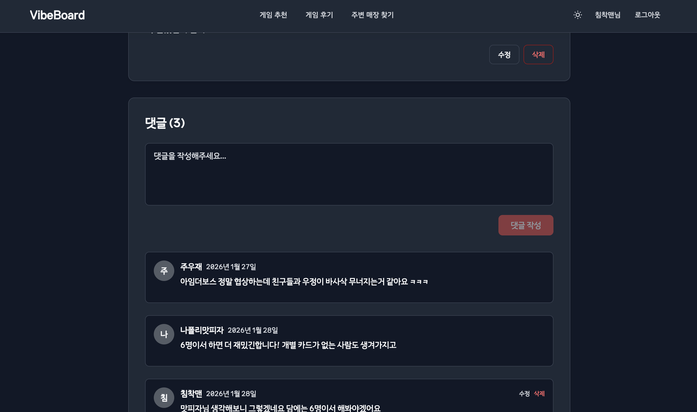

# VibeBoard

보드게임 추천, 리뷰 작성, 주변 보드게임 카페 검색을 한 곳에서 제공하는 웹 서비스입니다.

## 1. 프로젝트 개요

- 목적: 보드게임 탐색부터 후기 작성, 오프라인 매장 탐색까지 하나의 서비스 흐름으로 제공
- 핵심 포인트: 인증/권한, 지도 API 연동, 서버 상태 관리, 운영 환경 제어
- 개발 형태: 개인 프로젝트

## 2. 링크

- 배포: https://vibeboard-nine.vercel.app
- 저장소: https://github.com/guiyoung2/VibeBoard

## 3. 주요 기능

- 게임 목록/상세 조회 (`/games`, `/games/:id`)
- 리뷰 목록/상세/작성 (`/reviews`, `/reviews/:id`, `/reviews/create`)
- 현재 위치/검색어 기반 주변 보드게임 카페 검색 (`/cafes`)
- Supabase Auth 기반 로그인(이메일, Google, GitHub) 및 프로필 관리
- 다크 모드, 반응형 레이아웃, 로딩/에러/오프라인 상태 대응

## 4. 기술 스택

- Frontend: React 19, TypeScript, Vite 7, React Router 7
- State: TanStack Query 5, Zustand 5
- Backend/BaaS: Supabase (PostgreSQL, Auth, RLS)
- External API: 카카오 로컬 API, 카카오맵 JavaScript SDK
- Styling: Tailwind CSS 4
- Deploy/Automation: Vercel, GitHub Actions

## 5. 기술 선택과 구현 포인트

### React Query + Zustand 역할 분리

- 서버 상태(게임/리뷰 데이터)와 클라이언트 상태(인증/테마)를 분리해 관리 복잡도를 낮췄습니다.
- `invalidateQueries`를 활용해 리뷰 작성/수정 이후 목록 동기화를 일관되게 처리했습니다.

### Supabase 기반 인증/권한 제어

- 별도 백엔드 서버 없이 Auth + DB + RLS를 구성해, 서비스 기능 구현과 권한 제어를 함께 처리했습니다.
- 세션 저장소를 `sessionStorage`로 두어 탭 단위 로그인 정책을 명확히 유지했습니다.

### 지도 기능 최적화

- 카카오 로컬 API로 검색 결과를 가져오고, 카카오맵 SDK에서 커스텀 오버레이로 지도 시각화를 구현했습니다.
- 위치 기반/검색어 기반 흐름을 분리해 사용자 진입 경로를 명확히 했습니다.

### 운영 환경 제어

- `VITE_ALLOW_REVIEW_CREATE`로 리뷰 등록 허용 여부를 환경별로 제어했습니다.
- Supabase 무료 플랜 비활성화 방지를 위해 주기 호출 워크플로를 구성했습니다.

## 6. 성능 개선

- LCP: 44.3s -> 6.0s
- CLS: 0.362 -> 0
- Payload: 8.4MB -> 968KB

개선 방법:

- LCP 이미지 preload 적용
- 스켈레톤/실제 레이아웃 높이 정합성 보정
- 폰트/이미지 최적화 및 번들 청크 분리

## 7. 프로젝트 구조

```text
src/
├── components/   # 공통 UI (ErrorBoundary, Layout, NetworkStatus, Skeleton 등)
├── lib/          # 외부 연동/설정 (supabase, kakao, featureFlags)
├── pages/        # 라우트 페이지 (Home, Games, Reviews, Cafes, Auth, Profile)
├── stores/       # Zustand 스토어 (auth, theme)
├── types/        # 타입 정의
├── App.tsx
└── main.tsx
```

## 8. 실행 방법

```bash
npm install
npm run dev
```

## 9. 관련 문서

- `docs/에러_로딩_네트워크_기능_가이드.md`
- `docs/Supabase_KeepAlive_설정.md`

## 10. 스크린샷

### 메인/추천 화면


- 홈에서 추천 콘텐츠를 먼저 노출해 서비스 진입 후 탐색 흐름을 빠르게 만들었습니다.

### 게임 목록/상세 화면


- 목록 필터와 상세 조회를 연결해 작성자, 평점, 내용 확인 흐름을 단순화했습니다.


### 게임 리뷰/ 댓글 화면




### 주변 매장 검색/지도 화면


- 위치/검색어 기준 결과를 지도와 목록으로 동시에 제공해 탐색 편의성을 높였습니다.

## 11. 트러블슈팅

### 1) 초기 로딩 성능 저하(LCP/CLS/Payload) 문제

- 문제: 초기 성능 점검에서 LCP 지연, 레이아웃 흔들림, 과도한 리소스 용량이 동시에 발생했습니다.
- 원인: 주요 이미지 선요청 부재, 스켈레톤-실제 UI 높이 불일치, 폰트/이미지/번들 최적화 부족이 복합적으로 작용했습니다.
- 해결: LCP 이미지 preload, 레이아웃 예약 정합성 보정, 폰트/이미지 최적화 및 청크 분리를 적용했습니다.
- 결과: LCP 44.3s -> 6.0s, CLS 0.362 -> 0, Payload 8.4MB -> 968KB로 개선했습니다.

### 2) 환경별 리뷰 작성 정책 분리 문제

- 문제: 포트폴리오 배포 환경에서도 테스트 데이터가 계속 누적되어 운영 데이터 품질이 떨어졌습니다.
- 원인: 개발/배포 환경의 쓰기 정책이 동일해 데모 운영에 맞는 제어가 없었습니다.
- 해결: `VITE_ALLOW_REVIEW_CREATE` 플래그를 도입해 환경별로 리뷰 등록 허용 여부를 분리했습니다.
- 결과: 배포 환경에서는 데이터 오염을 방지하고, 개발 환경에서는 기존 작성 플로우를 유지할 수 있게 되었습니다.
